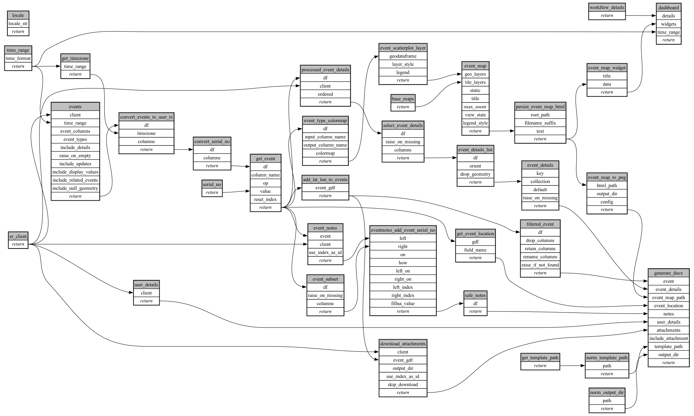

```
# AUTOGENERATED BY ECOSCOPE-WORKFLOWS; see fingerprint in README.md for details

```

```yaml
# fingerprint:
artifacts_sha256_basic: 7e77d73ada8a400ec924ad151ad79de57ed0c09753d985b29633c4bfa3ba70b7
artifacts_sha256_strict: da1d41cd4e4ac4146bc5b502dbf1d04aae23f3237f5d2f6f7924d533e2ecc475
installed_requirements:
- channel: https://repo.prefix.dev/ecoscope-workflows/
  name: ecoscope-workflows-core
  version: {version: ==0.22.16}
- channel: https://repo.prefix.dev/ecoscope-workflows/
  name: ecoscope-workflows-ext-ecoscope
  version: {version: ==0.22.16}
- channel: https://repo.prefix.dev/ecoscope-workflows-custom/
  name: ecoscope-workflows-ext-custom
  version: {version: ==0.0.43}
- channel: https://repo.prefix.dev/ecoscope-workflows-custom/
  name: ecoscope-workflows-ext-apn
  version: {version: ==0.0.14}
params_sha256: 428dc1c4a80aa081f5cdfa3657a00a7be09fba8081c70d3cdfce50dc84d9857d
spec_sha256: f2c608cae22d06ef7cdc8b3a23bc1ff78971f03c9cc197c581856cafedf09151

```

# ecoscope-workflows-individual-event-workflow


